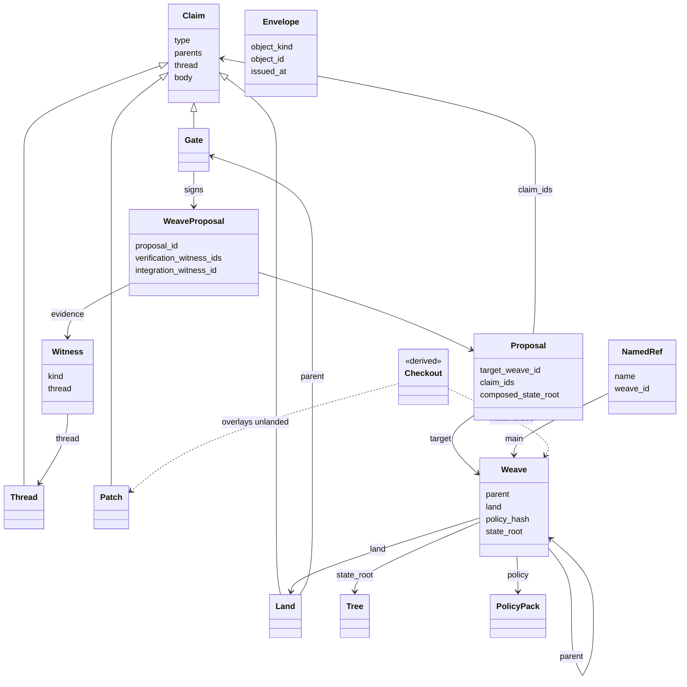
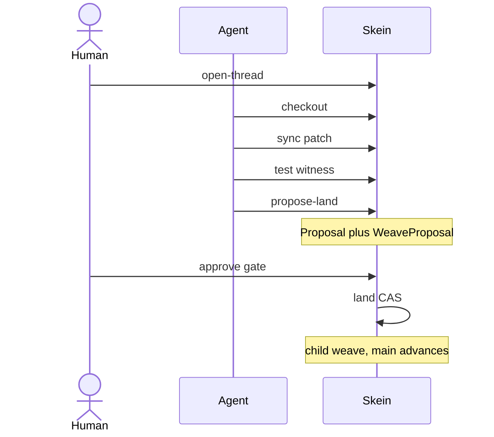

# Skein

A version control system for agentic development. **It is not Git.**

History is a graph of **claims**: decisions with evidence, policy, and a human gate. Code is what you get after a land is admitted. Agents work in bounded checkouts; humans approve an exact WeaveProposal, not a generic diff.

This repository is **Spec 0.7** plus a **Phase 1 CLI** written in Go.

```text
thread → checkout → patch → test → propose → approve → land
```

## Terms

Normative definitions live in [spec/skein-spec-0.7.md](spec/skein-spec-0.7.md) §2. This table is the landing-page subset.

| Term | Meaning |
| --- | --- |
| Claim | An immutable, content-addressed assertion. The atom of history. |
| Thread | A named line of work, opened by a `thread` claim. Status is derived; it is not a Git branch. |
| Checkout | A disposable working tree materialized from a weave (and optionally a thread). |
| Patch | A claim whose body is a deterministic list of file operations. |
| Witness | Content-addressed evidence (for example a test or integration run). |
| Proposal | Pre-approval object: exact target weave, claims, policy, and composed state root. |
| WeaveProposal | What a human approves: a Proposal plus required reviews and witnesses. |
| Gate | A human-authored claim that binds an approval to one WeaveProposal id. |
| Land | An admitted WeaveProposal. It becomes the next weave. |
| Weave | An immutable parent-linked manifest: one land (except at repo root), the policy in force, and the resulting state root. |
| State root | Domain-separated hash of the canonical tree of files. |
| Policy pack | Signed, versioned rules for what may land. Phase 1 pins `skein.bootstrap.v1`. |
| Envelope | Authentication wrapped around an object. Not part of that object's hashed id. |
| `thread_ref` / short id | Human lookup only. Slug from the thread title, or a unique 12-character prefix of a content hash. Identity remains the full SHA-256. |

## Object model

Claims are typed records in one append-only graph. A **land** is a claim. A **weave** is not: it is the parent-linked manifest that makes that land the current history. Checkout is derived and is not stored as history.



Envelope authenticates an object and is **not** part of that object's hashed id. `main` is a named ref that compare-and-swaps to a new weave; it is not a branch.



## Status

Phase 1 is a **local kernel**. It is usable for a trivial land loop today.

| In Phase 1 | Not in Phase 1 |
| --- | --- |
| Content-addressed objects (SHA-256) | WebAuthn production gates |
| Bootstrap policy `skein.bootstrap.v1` | Remote sync / multi-user service |
| Development-key gates | Redact hiding |
| Local CLI + `skein agent` JSON verbs | Policy-transition landing |
| Human thread names and short ids | Git export, board/packet UI, language-aware merge |

Later-phase objects are **parsed and refused**. They are never treated as trustworthy admission.

## Quick start

Requires [Go 1.22+](https://go.dev/dl/).

```text
go test ./... -count=1
go build -trimpath -ldflags="-s -w" -o skein.exe ./cmd/skein
```

On Windows, run the end-to-end demo:

```text
powershell -NoProfile -File .\demo.ps1
```

That builds `skein.exe` if needed, then init → thread → checkout → edit → sync → test → propose → approve → land → `why` / `log`, plus a stale reland and `agent port` refused as `policy`.

### Trivial land loop

Object ids are content hashes. You do not have to paste them: `--thread` accepts the title or slug, and other ids accept a unique 12-character prefix (`skein threads` lists them).

```text
skein init --path-mode case-sensitive
skein open-thread --title "hello" --scale trivial
skein checkout --thread hello --out co
# edit files in co/
skein sync --checkout co
skein test --thread hello
skein propose-land --thread hello
skein approve --weave-proposal <weave_proposal_id_short>
skein land --weave-proposal <weave_proposal_id_short>
skein why --path hello.txt
skein log
```

Every command writes one JSON object to stdout. Exit status is 0 if and only if `"ok": true`. Errors are `malformed`, `conflict`, `stale`, `unauthenticated`, `policy`, or `io`.

Agents use the same objects: `skein agent` with one JSON `{ "verb": ... }` on stdin. `verb: port` returns `policy` (not in Phase 1).

Command reference: [abi/phase1.md](abi/phase1.md).

## Build notes

Single static binary. No CGo. Stdlib plus `golang.org/x/text` for Unicode NFC.

Cross-compile for linux/arm64 (for example an Orange Pi):

```text
set GOOS=linux
set GOARCH=arm64
set CGO_ENABLED=0
go build -trimpath -ldflags="-s -w" -o skein-linux-arm64 ./cmd/skein
```

Stripped sizes (2026-10-07): windows/amd64 **3.56 MiB**, linux/arm64 **3.19 MiB**.

Bootstrap argv `true` is a built-in no-op so integration witnesses work on Windows (there is no `true` binary).

## Specification

Skein is specified as a Word narrative plus sidecar files. Two independent implementations must agree on hashed bytes: the Python spec oracle in `tools/` and this Go CLI.

| Artifact | Role |
| --- | --- |
| [skein-spec-0.7.docx](skein-spec-0.7.docx) | Published narrative: admission intent and algorithms |
| [spec/skein-spec-0.7.md](spec/skein-spec-0.7.md) | Authoring source for the Word file |
| [schemas/](schemas/) | **Byte identity.** JSON Schema for every v1 object |
| [schemas/canonical-json.md](schemas/canonical-json.md) | Canonical JSON v1 and domain prefixes |
| [schemas/policy/bootstrap.v1.json](schemas/policy/bootstrap.v1.json) | Evaluable bootstrap policy pack |
| [vectors/](vectors/) | Executable fixtures (`in.json` / `expected.json`) |
| [abi/phase1.md](abi/phase1.md) | Phase 1 CLI and agent ABI |

**Conflict rule:** schemas and vectors win for hashed bytes; the Word spec wins for admission intent and algorithms. Do not use `json.Marshal` / `json.dumps` for hashed bytes.

Regenerate vectors and the Word file:

```text
python -m pip install -r requirements.txt
python tools/generate_vectors.py
python tools/vector_runner.py
python tools/build_spec.py
```

`python tools/vector_runner.py` and `go test ./internal/conformance` must both pass the published `vectors/`.

Claim Phase 1 only when `go test ./...` and `python tools/vector_runner.py` are green.

## Layout

```text
cmd/skein/          Phase 1 CLI
internal/           Canonical JSON, objects, policy, store, repo, ABI
schemas/            JSON Schema and bootstrap pack (go:embed)
vectors/            Normative fixtures
abi/phase1.md       Commands, agent verbs, errors
tools/              Python spec oracle
demo.ps1            End-to-end land loop
```
